# Insight

## About

A quotes application with tons of quotes from ten thousands of authors, different quote backgrounds
and lots more to discover.

## Features

1. Daily quote(and notification).
2. Get quotes from followed authors and categories.
3. Different themes for quote background(Images, Gradients, Colors and Card).
4. Different fonts to choose from.
5. Light and Dark theme.
6. Low, Medium and High Contrast themes.
7. Auto scrolling animation for quotes.
8. And many more...

## Screenshots

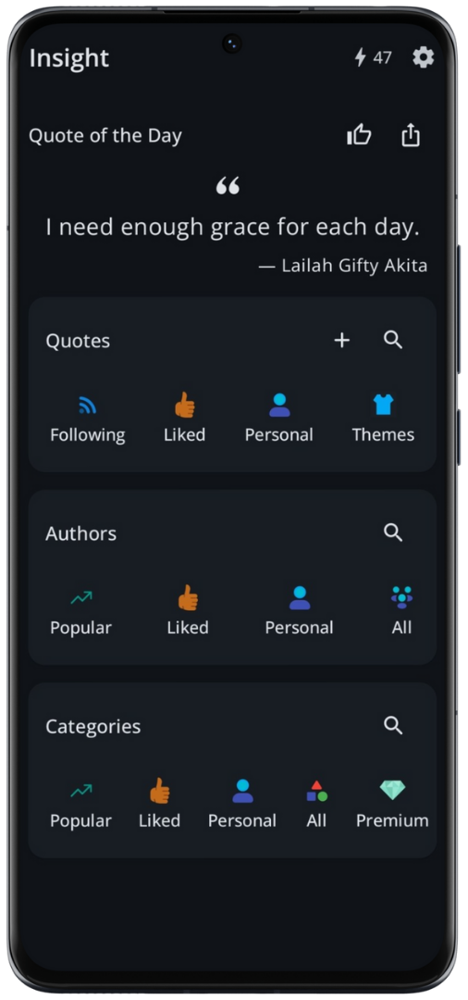
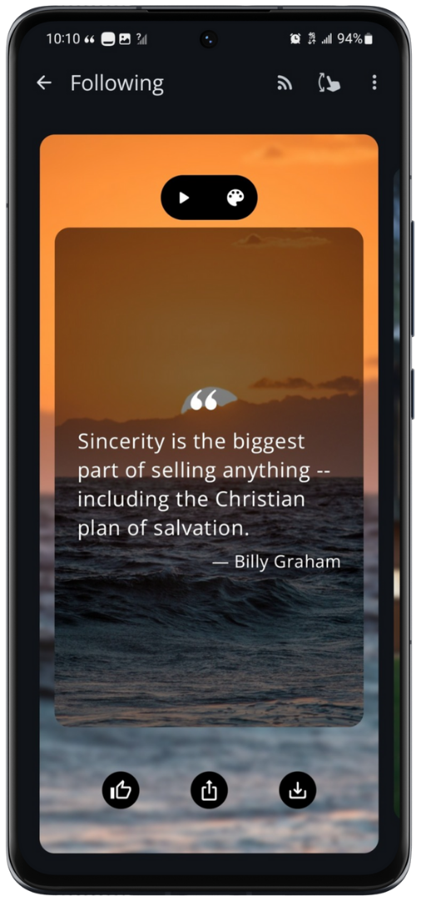
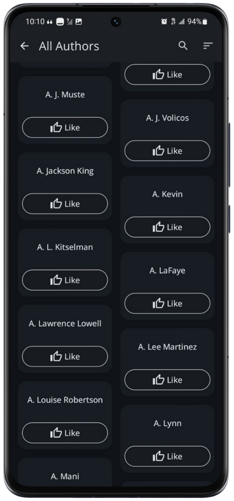
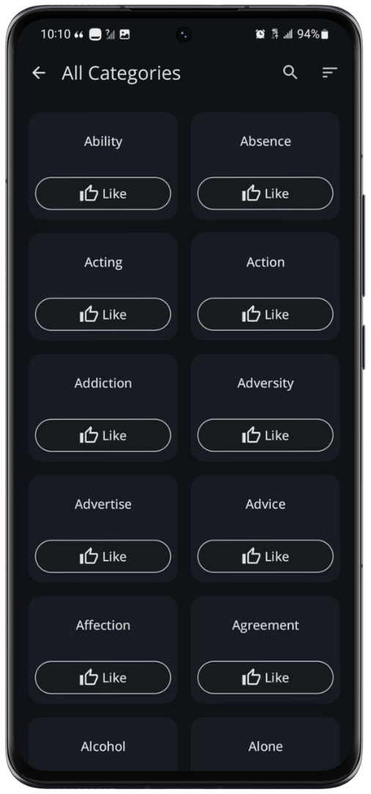
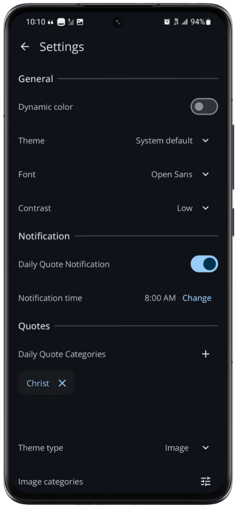

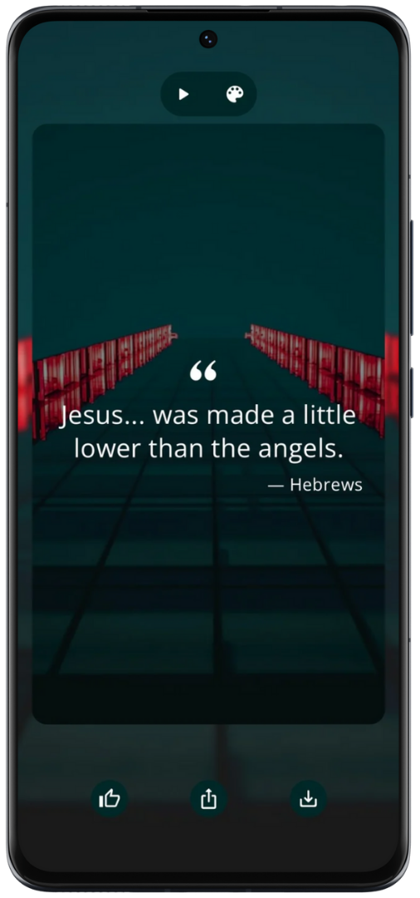
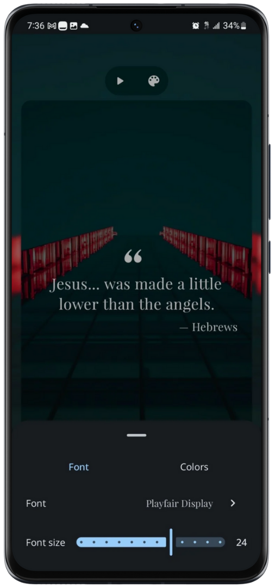
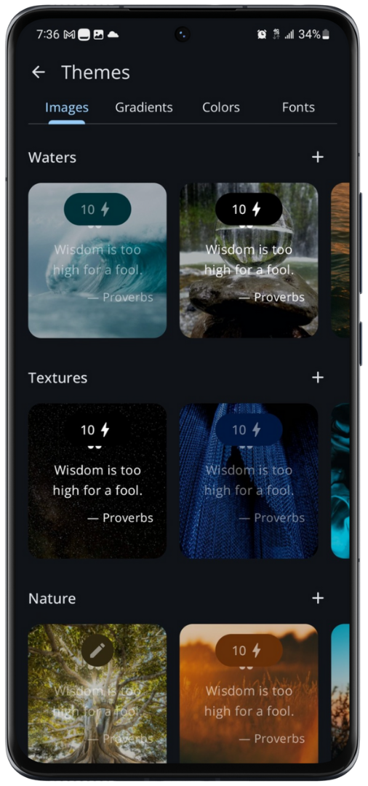
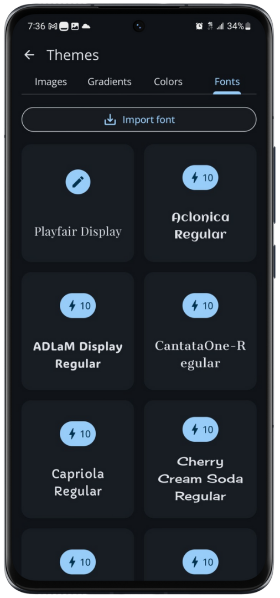
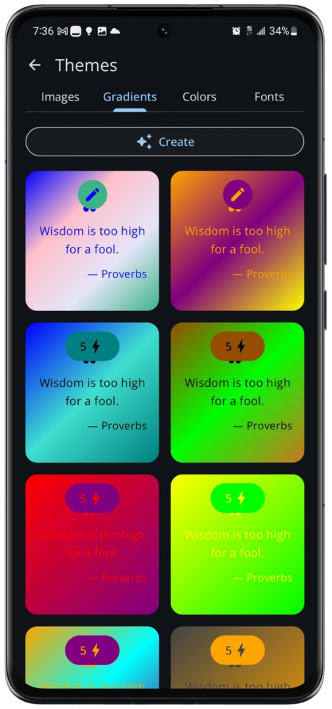
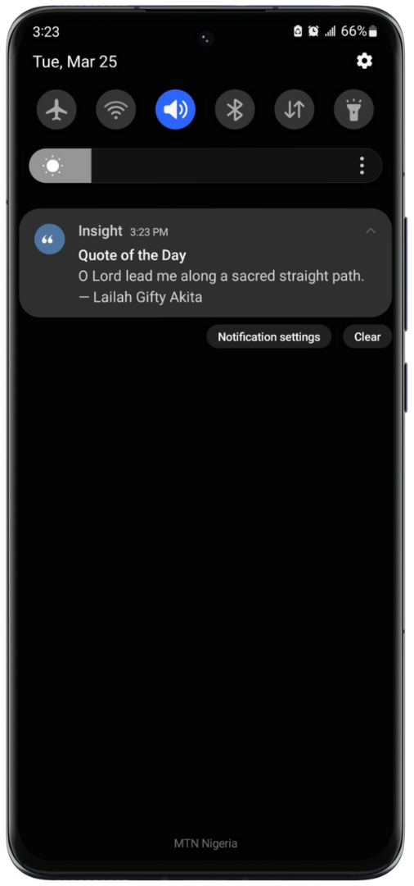